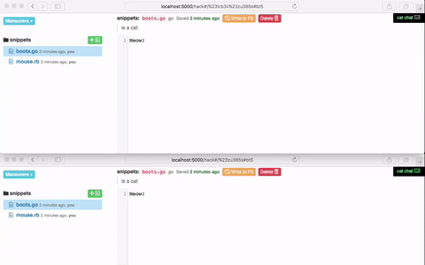

# Cathack. 
Host yourself some collaborative, kitten-friendly docs. 



Cathack uses Golang's Gin (server) and Melody (websockets) frameworks on the server side, along with Angular1, Bootstrap3, Codemirror, and just a few other helper libraries on the client-side to make hosting your own collaborative documents __as simple as possible__.

## Install
1. Clone it. 
2. `$ cd <where you put the clone>`
3. Now you've got to install some Go dependencies. Try `go get` from the base directory. If this doesn't work, a (tedious) way is just try to run `gocathack` and knock off the dependencies one-by-one with a `go get github.com/gin-gonic/gin`, etc. 
3. `gocathack` is the executable. Run it right away with `$ ./gocathack`, or jump down and do just a little custom configuration first. You can also rebuild the executable and call it anything you want with `$ go build -o myownstupidnamelikemain main.go`.

## Configure
All of the server-side configuration options live in `config/config.go`, which looks like this:
```
package config

// Path to Bolt database.
// Will be created if not exists.
var BoltDBPath = "hack.db"

// Name default bucket.
// Will be created along with the DB for the first time.
var DefaultBucketName = "snippets"

// Where to store FS files.
// The name of a directory relative to this working directory.
// ... This lets you store your snippets on the server as actual files,
// from which you can even use something like Syncthing to sync with your
// own computer.
var FSStorePath = "hacks"

// Where to store chat messages (just a plain ol .txt).
var ChatFile = "data/chat.txt"

// Which port would you like cathack to run on?
var MakeThisMyPort = ":5000"

```

## Of note
- __Authentication__ -- there is none. Just plug and play. TODO?
- __Protip__: use [Syncthing](https://syncthing.net) to sync your Cathack FS directory with your local computer. Cool!
- The Catchat feature uses a nifty GeoIp package (courtesy `github.com/oschwald/geoip2-golang`) which relies on `data/GeoLite2-City.mmdb`, weighing in at a whopping 63 megabytes. Expensive. Knowing where you are in the world? Priceless. 

## Contribute
Much of the work already contributing to this project has been begged, borrowed, and ~~stolen~~ kindly (under license, very hopefully... surely?) resituated to help out. Thanks to those whose work is already here, though they may not even know it (yet!).

Like to contribute? Step on up! Pull request ahoy.  


